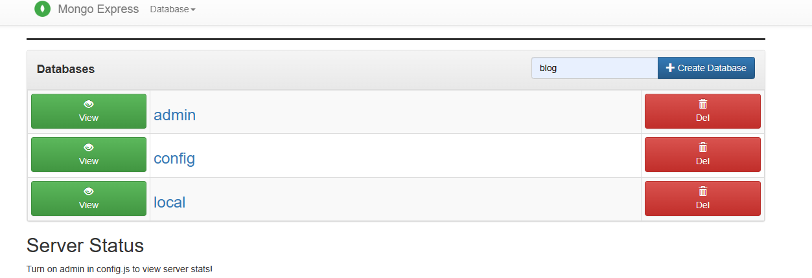

# STEP 1
- docker-compose up
# STEP 2
go to http://localhost:8081/

create blog document 

and after Run project

# API DETAIL 
   All api  have a ./src/postman folder 

   - blog like
   - blog dislike 
   - user update 
   - user delete 
   apies is authenticate 